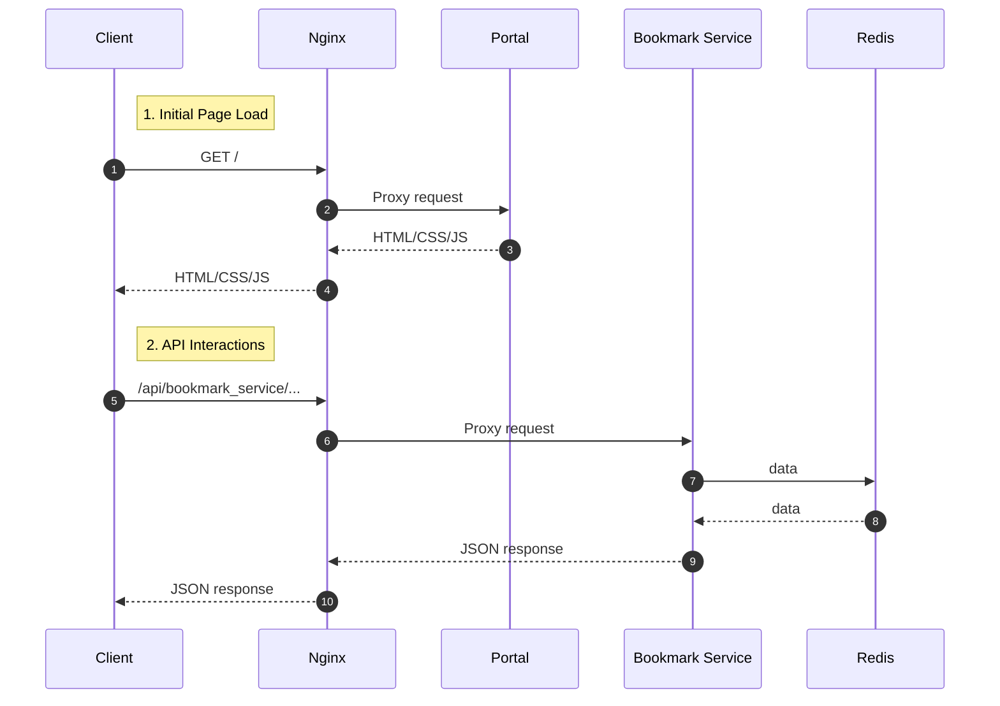

# Bookmark manager deployment

## Architecture

```mermaid
sequenceDiagram
    autonumber
    participant Client
    participant Nginx
    participant Portal
    participant API as Bookmark Service
    participant Redis

    rect rgb(255, 255, 255)
        note right of Client: 1. Initial Page Load
        Client->>Nginx: GET /
        Nginx->>Portal: Proxy request
        Portal-->>Nginx: HTML/CSS/JS
        Nginx-->>Client: HTML/CSS/JS
    end

    rect rgb(255, 255, 255)
        note right of Client: 2. API Interactions
        Client->>Nginx: /api/bookmark_service/...
        Nginx->>API: Proxy request
        API->>Redis: data
        Redis-->>API: data
        API-->>Nginx: JSON response
        Nginx-->>Client: JSON response
    end
```

## Deployment

- [Guide](DEPLOYMENT.md)
